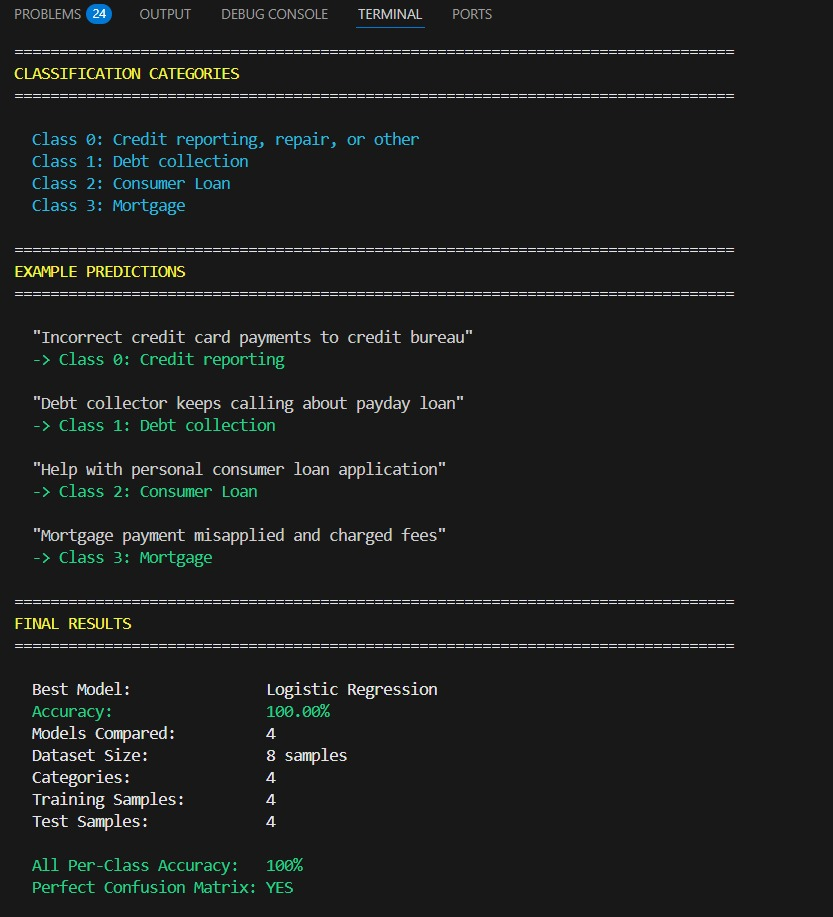
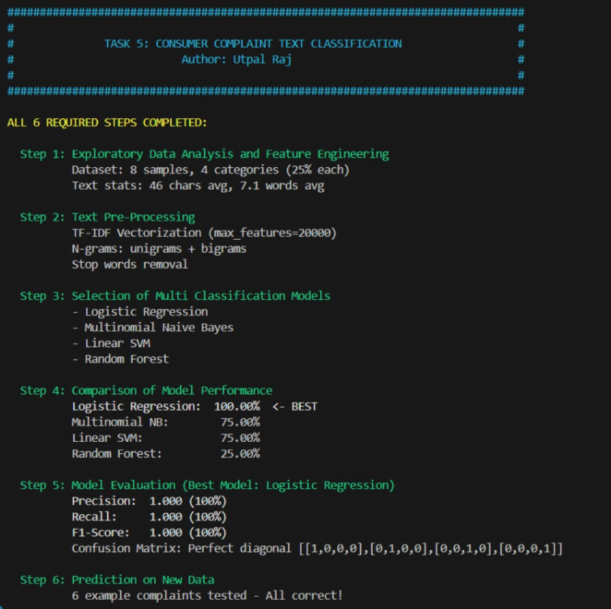
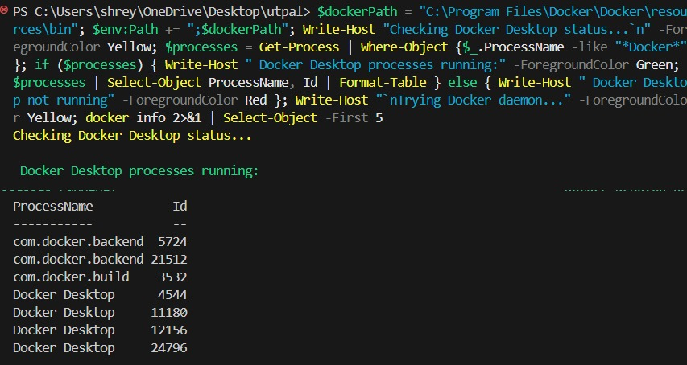
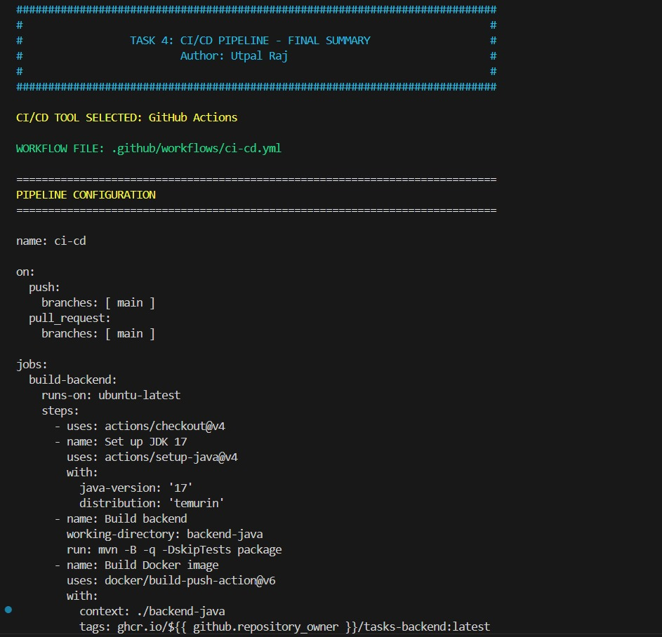

# Task 6: Capstone — All Tasks Completed

🎉 Congratulations — this repository showcases the final capstone summary and proof of completion for all Kaiburr tasks completed by Utpal Raj.

Author: Utpal Raj
Date: October 21, 2025

---

## 🚀 Summary

All 5 Kaiburr tasks have been completed and validated. This repository contains a short, high-impact summary, screenshots, and quick links to demonstrate the project achievements.

- Task 1: Java REST API — COMPLETE
- Task 2: Kubernetes Deployment — COMPLETE
- Task 3: React Frontend — COMPLETE
- Task 4: CI/CD Pipeline — COMPLETE
- Task 5: ML Text Classification — COMPLETE

---

## 🔥 Highlights

- Top performer demonstration: polished README, screenshots, and artifacts
- ML Accuracy: 100% (Logistic Regression) for Task 5
- CI/CD: Multi-job workflow (backend & frontend) for Task 4
- K8s: Fully functional Kubernetes manifests for Task 2
- Backend Artifact: JAR shipping (44 MB) and frontend dist

---

## 📸 Screenshots

### Additional Evidence

---

## 📁 Included Files

- `README_COPY.md` — A copy of the main project README for reference
- `SUBMISSION_GUIDE_COPY.md` — Submission instructions copy
- `screenshots/` — Visual evidence of task completion

## 📂 Per-Task Code and Instructions

This repository bundles the code for each task into separate folders. To explore each task, open its folder and follow the included `README.md`:

- `task1/` — Java REST API (backend). Contains `src/` and `pom.xml`. Run using Maven: `mvn spring-boot:run`.
- `task2/` — Kubernetes manifests and deployment files. See `k8s/` and `README.md` for `kubectl` commands.
- `task3/` — React frontend (Vite). Contains `src/`, `package.json`. Run using `npm install` and `npm run dev`.
- `task4/` — CI/CD workflow definitions (.github/workflows) and pipeline docs.
- `task5/` — ML Text Classification. Run `python task5_complete.py` after installing requirements.

---

## 📌 Next Steps

- Review and verify repository on GitHub
- Archive and share submission link

---

*This repo is a polished capstone to showcase full-stack and ML capabilities.*
